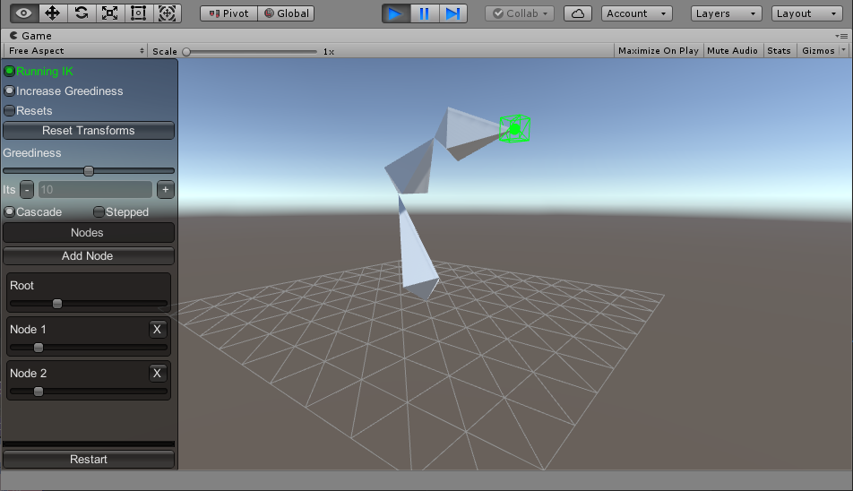

# Simple IK Sample

Sample code for a simple implementation of inverse kinematics in Unity.

See [this link](https://pixeleuphoria.com/blog/index.php/2023/01/21/ik-solver-from-scratch-in-unity/) for a browser demo and more information.

<video src='./preview.webm' width=800/>